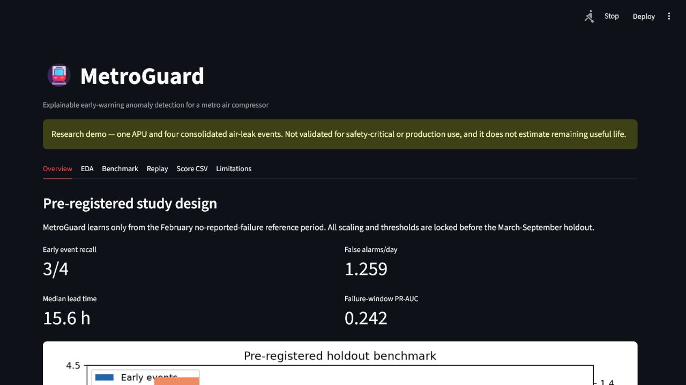
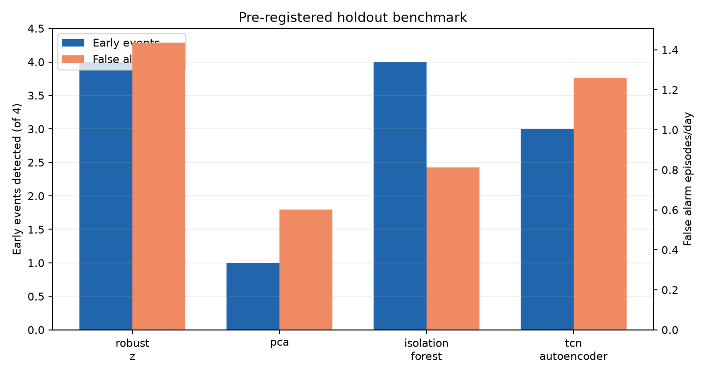
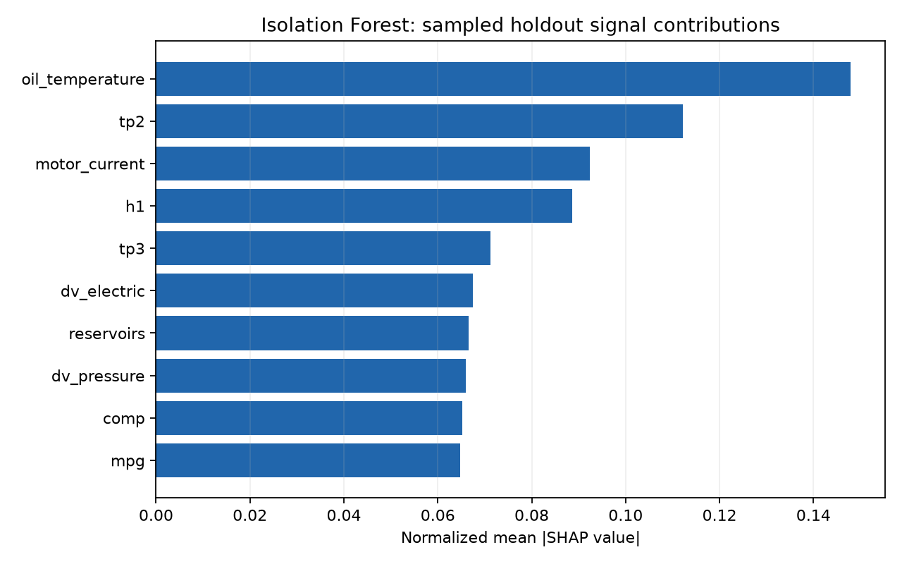
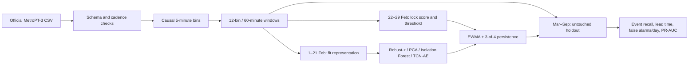

# MetroGuard

[](https://github.com/firathdr/metroguard-ml/actions/workflows/ci.yml)
[](https://www.python.org/)
[](LICENSE)
[](DATA_CARD.md)

**Explainable early-warning anomaly detection for a metro train air compressor.**

MetroGuard is a leakage-safe Data Science case study built on 1,516,948 real sensor records
from the [UCI MetroPT-3 dataset](https://doi.org/10.24432/C5VW3R). It learns a reference model
from February 2020, locks every transformation and alert threshold, and then evaluates once on
the March–September holdout containing four consolidated air-leak incidents.

> **Research demonstration only.** One APU and four incidents are not enough to establish
> production or safety-critical validity. MetroGuard does not predict remaining useful life and
> an anomaly explanation is not proof of root cause.



## Results

The table below is generated from `reports/metrics.json`; no accuracy target was chosen after
looking at the holdout.

| Model | Early event recall | False alarms/day | Failure-window PR-AUC | Time in alert |
|---|---:|---:|---:|---:|
| Robust-z baseline | 4/4 | 1.435 | 0.134 | 14.75% |
| PCA reconstruction | 1/4 | 0.601 | 0.259 | 8.89% |
| Isolation Forest | 4/4 | 0.811 | 0.485 | 35.36% |
| **TCN autoencoder (pre-registered primary)** | **3/4** | **1.259** | **0.242** | **18.15%** |

The pre-registered TCN reached a median 15.6-hour lead time across its three early detections;
the fourth incident was detected late. Isolation Forest ranked better retrospectively on event
recall and false-alarm rate, but spent 35.4% of holdout time in alert. It is therefore reported
as a useful comparison, not promoted post hoc to the primary model.

The headline event metric is always reported as `k/4`, never as a percentage. An early alert
must overlap the window from 24 hours to 2 hours before an incident. Alerts in the final two
hours or during an incident are reported as late detections, while unrelated episodes contribute
to false alarms/day.





## Study design



- Raw readings are approximately 10 seconds apart, but jitter and gaps are preserved.
- Analog signals use mean/std/min/max/last; digital signals use active ratio/transitions/last.
- No centered rolling feature, backfill, future interpolation, random row split, or full-data
  scaling is allowed.
- Bins below 80% expected coverage are rejected instead of imputed.
- The alert policy is fixed at calibration `q=0.995`, causal EWMA `alpha=0.2`, 3-of-4
  persistence, 30-minute merge, and 6-hour cooldown.

See [DATA_CARD.md](DATA_CARD.md), [MODEL_CARD.md](MODEL_CARD.md), and the thin reproducible
notebooks for the full methodology and limitations.

## Quickstart

### Native Python

```powershell
py -3.12 -m venv .venv
.venv\Scripts\Activate.ps1
python -m pip install --upgrade pip
pip install -r requirements.lock
pip install -e . --no-deps
metroguard reproduce
metroguard dashboard
```

The complete reproduction downloads about 208 MB, validates the pinned SHA-256 digest,
prepares causal Parquet features, trains all four fixed models, and regenerates every table and
figure. Individual stages are also available:

```bash
metroguard data download
metroguard data prepare
metroguard train --all
metroguard evaluate
metroguard api --port 8000
metroguard dashboard --port 8501
```

### Docker

```bash
docker compose up --build
```

- API and OpenAPI docs: http://localhost:8000/docs
- Dashboard: http://localhost:8501

## API contract

- `GET /health` — package version and release-model availability.
- `GET /v1/model-card` — immutable split, threshold, metrics, provenance, and limitations.
- `POST /v1/score` — accepts at least 75 consecutive minutes of canonical raw sensor readings
  and returns the latest normalized score, threshold, sustained alert state, data-quality details,
  and five leading signal contributions.

The scoring endpoint is deliberately bounded and stateless. It supports historical research
replay; it is not an online maintenance controller.

## Repository map

```text
src/metroguard/       Tested package: data, models, metrics, API, dashboard, CLI
configs/              Pre-registered split, model, and alert protocol
notebooks/            Thin EDA and evaluation narratives; logic stays in src/
reports/              Machine-generated metrics, tables, figures, and scores
artifacts/release/    Versioned model, scaler, threshold, schema, and provenance
tests/                Unit, contract, leakage, and smoke tests
```

## Reproducibility and quality

- Python 3.12 and a fully pinned `requirements.lock`.
- Seed 42, deterministic Torch operations where available, data SHA-256, Git revision, and
  experiment manifests.
- Ruff, strict mypy, pytest, and coverage gate in GitHub Actions.
- Separate non-root API and dashboard Docker services.
- Full-data training is local by design; CI exercises the package with synthetic fixtures and
  builds both images without spending hosted compute on the 208 MB dataset.

## Citation and licenses

Code is MIT licensed. The dataset and the small historical replay extract are CC BY 4.0:

> Davari, N., Veloso, B., Ribeiro, R., & Gama, J. (2021). MetroPT-3 Dataset. UCI Machine
> Learning Repository. https://doi.org/10.24432/C5VW3R

The related DSAA paper is methodological context; other MetroPT releases are not mixed into
this project.
