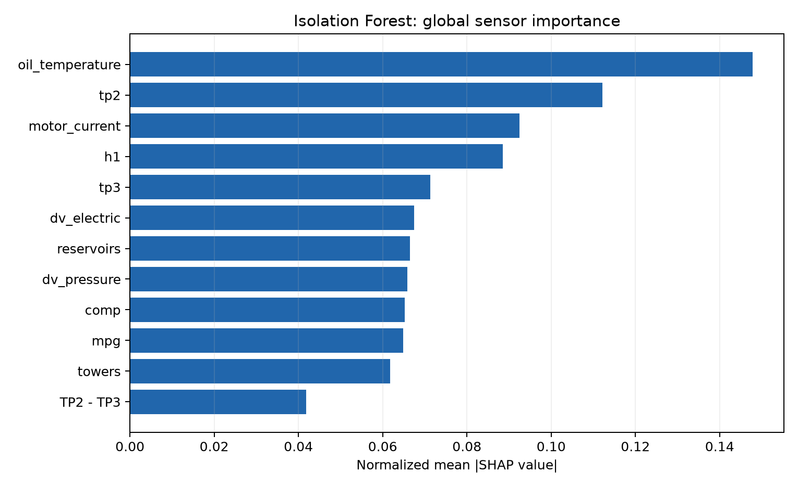
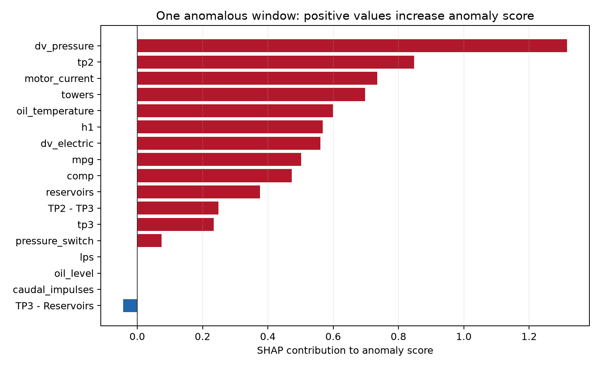
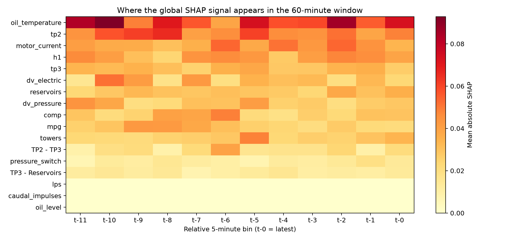

# MetroGuard — SHAP ile açıklanabilirlik

MetroGuard, metro trenlerindeki hava kompresörü için erken uyarı amaçlı bir anomali tespit projesidir. Model alarm ürettiğinde yalnızca “anomali var” demek yerine, alarm skorunu en çok etkileyen sensör gruplarını da göstermek için SHAP kullandım.

## Portföyde kullanılabilecek kısa açıklama

> MetroGuard modeline TreeSHAP tabanlı açıklanabilirlik katmanı ekledim. Isolation Forest’ın örneklenmiş holdout pencerelerini SHAP ile açıklayıp, 60 dakikalık penceredeki çok sayıdaki mühendislik özelliğini tekrar sensör gruplarına topladım. Böylece global ölçekte hangi sensörlerin anomali skoruna en fazla katkı verdiğini ve tek bir anomalik pencerede hangi sensörlerin skoru yükselttiğini görselleştirdim. Pozitif yerel SHAP katkısı daha yüksek anomali skorunu, negatif katkı ise daha düşük anomali skorunu ifade eder.

## Üretilen görseller

Global grafik, örneklenmiş holdout pencerelerinde `mean(|SHAP|)` değerlerinin sensör bazında normalize edilmiş halini gösterir. Bu sıralama önem düzeyini anlatır; tek başına nedensellik veya fiziksel kök neden kanıtı değildir.

Yerel grafik, örneklem içindeki en yüksek Isolation Forest anomali skoruna sahip tek pencereyi açıklar. Kırmızı çubuklar anomali skorunu artıran, mavi çubuklar azaltan katkıları gösterir.

Isı haritası, 60 dakikalık pencerenin hangi 5 dakikalık bölümlerinde ve hangi sensör gruplarında SHAP sinyalinin yoğunlaştığını gösterir.

## Teknik not

- SHAP açıklaması `src/metroguard/explainability.py` içinde tekrar kullanılabilir fonksiyonlar olarak tutulur.
- Pipeline, `metroguard train --all` sonrasında aşağıdaki çıktıları üretir:
  - `reports/isolation_forest_shap.csv`
  - `reports/isolation_forest_shap_local.csv`
  - `reports/isolation_forest_shap_time.csv`
  - `reports/figures/isolation_forest_shap.png`
  - `reports/figures/isolation_forest_shap_local.png`
  - `reports/figures/isolation_forest_shap_heatmap.png`
- Açıklanabilirlik katmanı Isolation Forest karşılaştırıcısı içindir. Projenin önceden kaydedilmiş birincil modeli TCN autoencoder’dır; TCN için mevcut piksel-bazlı yeniden oluşturma katkıları ayrıca raporlanır.

## Sınırlar

SHAP, modelin öğrendiği davranışın açıklamasıdır; sensörün fiziksel olarak arızaya neden olduğunu kanıtlamaz. Veri tek bir APU ve dört konsolide olay içerdiği için sonuçlar araştırma/portföy gösterimidir, güvenlik-kritik üretim kararı olarak kullanılmamalıdır.

Kaynak kod: [`src/metroguard/explainability.py`](../src/metroguard/explainability.py)
